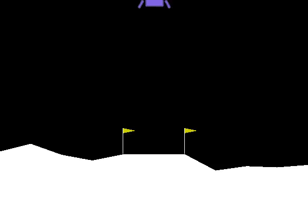

# REINFORCE and A2C

The repository contains implementations of REINFORCE and A2C (Advantage Actor Critic), the two well known policy gradient algorithms, on LunarLander-v2 environment of Open AI Gym.

Requirements:

1. Keras
2. PyTorch
3. TensorFlow
4. Open AI Gym

Trained Model on Lunar Lander:

